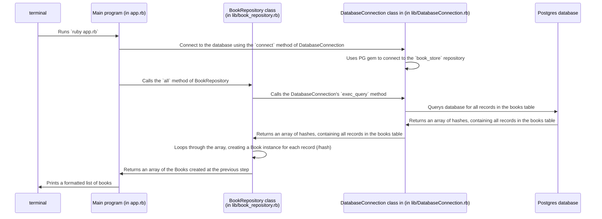

```mermaid
sequenceDiagram
    participant t as terminal
    participant app as Main program (in app.rb)
    participant br as BookRepository class <br /> (in lib/book_repository.rb)
    participant db_conn as DatabaseConnection class in (in lib/DatabaseConnection.rb)
    participant db as Postgres database

    t->>app: Runs `ruby app.rb`
    app->>db_conn: Connect to the database using the `connect` method of DatabaseConnection
    db_conn->>db_conn: Uses PG gem to connect to the `book_store` repository

    app->>br: Calls the `all` method of BookRepository
    br->>db_conn: Calls the DatabaseConnection's `exec_query` method
    db_conn->>db: Querys database for all records in the books table
    db->>db_conn: Returns an array of hashes, containing all records in the books table
    db_conn->>br: Returns an array of hashes, containing all records in the books table
    br->>br: Loops through the array, creating a Book instance for each record (/hash)
    br->>app: Returns an array of the Books created at the previous step
    
    app->>t: Prints a formatted list of books
```